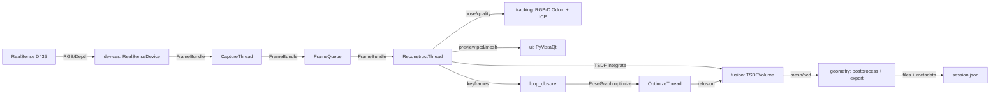
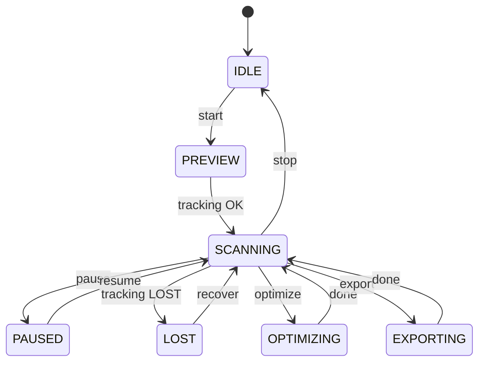

# 技术说明

**语言**：中文 | [English](TECHNICAL_EN.md)  
**返回**：[README](../README.md)

本说明面向希望理解系统架构与算法细节的读者，重点解释数据流、跟踪与回环策略，以及 TSDF 融合的设计取舍。

## 1. 系统目标与适用范围
- **目标**：在 Intel RealSense D435 上实现可用的手持 RGB-D 扫描与三维重建，支持实时/半实时/离线三种模式，并具备回环检测与全局一致优化。
- **适用范围**：
  - 手持扫描，主要距离 **0.2–1.0m**。
  - 场景：小物体、桌面级物体、中等物体（含人体上半身）。
  - 三种模式：
    - realtime：采集、跟踪、融合同步进行。
    - semi：跟踪实时，融合抽帧。
    - offline：基于 `.bag` 回放重建，适合高质量输出。

## 2. 总体架构与模块职责

### 2.1 数据流（Mermaid）

### 2.2 状态机（Mermaid）

## 3. RealSense 与深度要点

### 3.1 depth_scale 与内参
- RealSense 输出深度以 **单位深度值** 表示，需要乘 `depth_scale` 得到米。
- 本项目统一将深度转换为 **毫米**：`depth_mm = depth_raw * depth_scale * 1000`。
- Open3D 使用 `depth_scale=1000.0` 将毫米转换为米。
- 内参（fx, fy, cx, cy）由 RealSense SDK 获取并缓存。

### 3.2 depth-to-color 对齐
- 使用 `rs.align(rs.stream.color)` 将深度对齐到彩色帧，使 RGB 与 Depth 像素对应。
- 对齐后可直接用于 RGB-D odometry、TSDF 融合与回环特征提取。

### 3.3 深度噪声来源
- 红外 speckle 和多路径干扰。
- 反光/黑色材质导致深度缺失或跳变。
- 近距离 (<0.2m) 深度质量显著下降。

### 3.4 内置滤波链
滤波链顺序：**decimation → spatial → temporal → hole-filling → threshold**

- **Decimation**：降低分辨率，提高速度但牺牲细节。
  - `decimation_magnitude` 2–4。
- **Spatial**：空间平滑，减少噪声但可能模糊边缘。
  - `spatial_alpha` 0.4–0.6
  - `spatial_delta` 15–30
- **Temporal**：时间滤波，减少闪烁但会有延迟。
  - `temporal_alpha` 0.3–0.5
  - `temporal_delta` 15–30
- **Hole-filling**：填补小空洞。
  - `hole_filling_mode` 1–2
- **Threshold**：裁剪深度范围（与扫描距离匹配）。

## 4. 位姿估计原理

### 4.1 RGB-D Odometry
- Open3D `compute_rgbd_odometry` 基于 **光度项 + 几何项** 优化相邻帧位姿：
  - 光度项：颜色一致性，依赖纹理与光照稳定。
  - 几何项：深度一致性，依赖几何结构与深度质量。
- 多尺度金字塔提高收敛稳定性，但运动过快仍可能失败。
- 输出：`T_prev->curr` 与信息矩阵（后续 PoseGraph 使用）。

**收敛条件**：
- 连续帧重叠充分
- 运动增量较小
- 纹理与深度质量稳定

### 4.2 ICP (point-to-plane) 精配准
- 在 odometry 初值基础上进行 ICP 精配。
- 使用点到面误差，对表面平滑场景更稳定。
- **何时有效**：几何结构明显、法线可靠、初值合理。
- **阈值选择**：`max_correspondence` 与场景尺度相关，小物体 0.02–0.03，人体 0.04–0.06。

### 4.3 跟踪质量评估与 LOST 判定
- **指标**：
  - `inlier_ratio`（Open3D fitness）
  - `rmse`（inlier_rmse）
  - 运动突变阈值（平移/旋转）
- **判定逻辑**：
  - inlier_ratio 高 + rmse 低 + 运动平稳 → OK
  - inlier_ratio 中等 + rmse 适中 → WARN
  - inlier_ratio 低或 rmse 大，或运动突变 → LOST
- LOST 时停止融合并提示 UI，恢复后可继续。

## 5. 关键帧策略
- 阈值：平移/转角/质量/时间间隔。
- **模式差异**：
  - realtime：采样较稀，降低计算负载。
  - semi：更密集采样，便于回环。
  - offline：允许高密度采样，提升最终质量。
- 关键帧对回环检测与优化后重融合至关重要。

## 6. 回环与位姿图优化（核心）

### 6.1 候选生成策略
- 结合 **时间间隔** 与 **轨迹空间近邻**。
- 复杂度：默认只对“最新关键帧”生成候选，复杂度 O(N)。
- 可选 `use_all_frames=true`，遍历所有关键帧对，复杂度 O(N^2)。

### 6.2 FPFH + RANSAC 粗配准
- 将关键帧点云下采样。
- 计算 FPFH 特征。
- RANSAC 生成粗配准变换，过滤明显错误候选。

### 6.3 ICP 精配准
- Colored ICP（默认）或 point-to-plane ICP。
- 在 RANSAC 初值基础上精化回环约束。

### 6.4 PoseGraph
- **顺序边**：相邻关键帧的里程计约束（uncertain=False）。
- **回环边**：非相邻关键帧的回环约束（uncertain=True）。
- **信息矩阵**：由 `get_information_matrix_from_point_clouds` 计算，反映约束可信度。

### 6.5 全局优化影响
- 消除累积漂移，提升全局一致性。
- 优化后轨迹用于重融合，显著改善模型闭合处的错位问题。

## 7. TSDF 融合与重融合

### 7.1 TSDF 直观定义
- 每个体素存储“截断的有符号距离”。
- 物体表面位于 TSDF = 0 等值面。

### 7.2 关键参数
- `voxel_length`：体素大小，越小越精细但计算量增大。
- `sdf_trunc`：截断范围，通常 3–5×voxel。
- `depth_trunc`：深度截断距离。

### 7.3 ScalableTSDFVolume
- 动态扩展体素块，适合手持扫描的未知范围场景。

### 7.4 坐标约定
- 本项目约定 **pose = world_T_cam（相机到世界）**。
- TSDF integrate 直接使用 `pose` 作为外参。

### 7.5 重融合
- 优化后，使用关键帧序列与优化轨迹重新融合。
- 可显著提高闭合处一致性与网格质量。

## 8. 网格提取与后处理
- **Marching Cubes**：从 TSDF 提取三角网格。
- **法线**：`compute_vertex_normals`。
- **连通域过滤**：保留最大连通域或按三角数阈值过滤。
- **简化**：quadric decimation 降低面数。
- **平滑**：simple smoothing。

## 9. 参数总表（默认值/建议范围/影响/场景）
| 参数 | 默认 | 建议范围 | 影响 | 典型场景 |
|---|---|---|---|---|
| device.depth_min_m | 0.2 | 0.2–0.3 | 深度裁剪下限 | 近距离小物体 |
| device.depth_max_m | 1.0 | 1.0–1.5 | 深度裁剪上限 | 中物体 |
| tracking.odom.max_depth_diff | 0.07 | 0.05–0.08 | odom 稳定性 | 通用 |
| tracking.icp_refine.max_correspondence | 0.03 | 0.02–0.05 | ICP 搜索半径 | 通用 |
| tracking.quality.motion_translation_warn/lost | 0.15/0.3 | 0.1–0.4 | 运动突变判定 | 快速移动 |
| tracking.quality.motion_rotation_warn/lost | 20/45 | 15–60 | 旋转突变判定 | 快速转动 |
| keyframe.min_translation | 0.03 | 0.02–0.05 | 关键帧密度 | 小物体 |
| keyframe.min_rotation_deg | 5.0 | 3–8 | 关键帧密度 | 通用 |
| keyframe.max_keyframes | 300 | 200–1000 | 内存控制 | 大场景 |
| loop_closure.temporal_gap | 30 | 20–50 | 回环候选 | 通用 |
| loop_closure.max_distance | 0.4 | 0.3–0.6 | 回环搜索半径 | 中物体 |
| fusion.voxel_length | 0.004 | 0.003–0.008 | 模型细节 | 小物体 |
| fusion.sdf_trunc | 0.02 | 0.015–0.04 | 表面鲁棒性 | 通用 |
| fusion.depth_trunc | 1.0 | 0.8–1.5 | 深度范围 | 中物体 |
| fusion.preview_voxel | 0.01 | 0.005–0.02 | 预览性能 | 实时预览 |
| mesh.simplify_target_triangles | 200k | 50k–500k | 面数控制 | 输出优化 |

## 10. 性能与稳定性
- **线程模型**：Capture/Recon/Optimize 三线程，避免 UI 卡死。
- **限频策略**：preview_stride、fusion_stride 控制预览与融合频率。
- **内存控制**：关键帧窗口裁剪 + 预览点云下采样。

## 11. 常见失败模式与排障 checklist
- **跟踪漂移/丢失**：
  - 减慢移动速度，保持视野重叠。
  - 增强纹理（贴纸/报纸）。
  - 调整 `icp_refine.max_correspondence`。
- **深度空洞**：
  - 启用 hole-filling。
  - 增加 spatial/temporal 强度。
- **反光/黑色材质**：
  - 使用哑光喷雾或改变角度。
- **USB 带宽不足**：
  - 降低分辨率/FPS。
  - 使用 USB3.0 直连。
- **帧率不足**：
  - 关闭部分滤波。
  - 提高 `fusion_stride`。

## 12. 测试策略
- **单元测试**：配置加载、会话 schema、矩阵工具、导出路径。
- **集成测试**：用 `.bag` 回放验证完整管线输出。
- **回归测试**：固定 bag 数据 + 固定参数比对输出统计（点数、面数、体素体积）。
