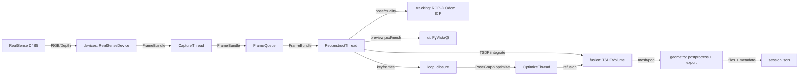
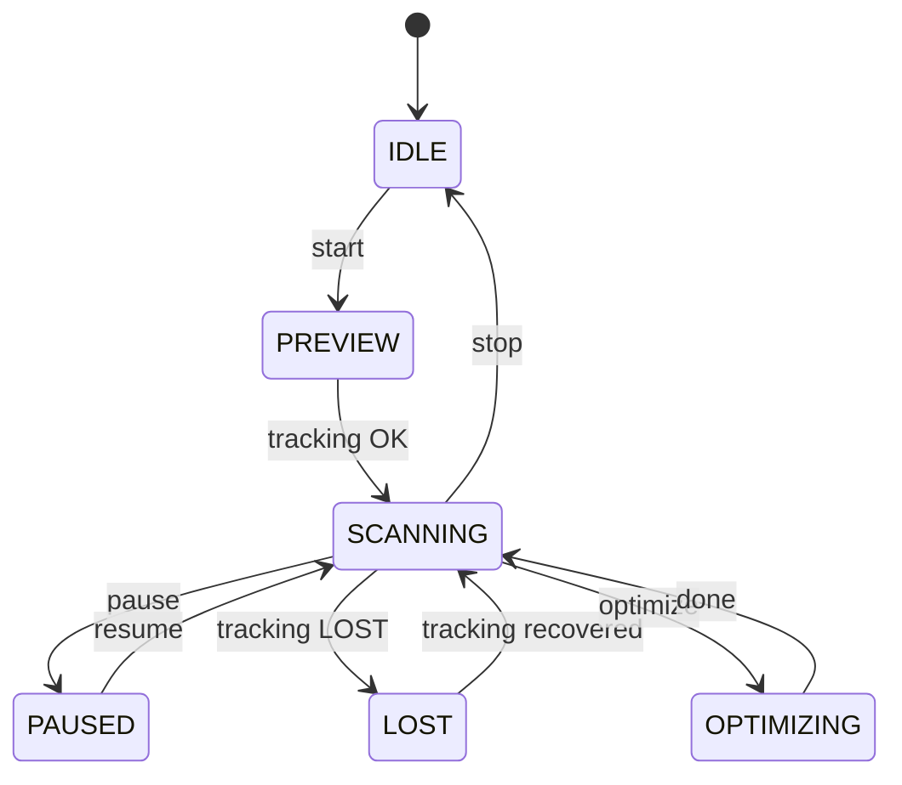

# Technical Notes

**Language**: [中文](TECHNICAL.md) | English  
**Back**: [README](../README_EN.md)

This document is for readers who want to understand the architecture and algorithmic decisions, including data flow, tracking + loop closure, and TSDF fusion trade-offs.

## 1. System Goals and Scope
- **Goal**: Provide a usable handheld RGB-D scanning and 3D reconstruction pipeline on Intel RealSense D435, supporting realtime/semi/offline modes with loop closure and global consistency.
- **Scope**:
  - Handheld scanning at **0.2–1.0m**.
  - Scenes: small objects, desktop-scale objects, medium objects (including upper body).
  - Modes:
    - realtime: capture, tracking, fusion are synchronized.
    - semi: tracking in realtime, fusion on subsampled frames.
    - offline: reconstruction from `.bag` playback for best quality.

## 2. Overall Architecture and Module Responsibilities

### 2.1 Data Flow (Mermaid)

### 2.2 State Machine (Mermaid)

## 3. RealSense and Depth Essentials
- **depth_scale**: provided by RealSense; used to convert depth units to meters. Pipeline uses depth in **mm**, and Open3D uses `depth_scale = 1000`.
- **depth-to-color alignment**: aligns depth to RGB for pixel-wise colorization.
- **intrinsics**: fx, fy, cx, cy are cached in `FrameBundle`.
- **depth noise sources**: baseline/IR noise, reflective/transparent surfaces, occlusions.
- **Filters**:
  - **decimation**: downsample depth to improve speed and reduce noise.
  - **spatial**: spatial smoothing, preserves edges.
  - **temporal**: temporal smoothing, reduces jitter.
  - **hole-filling**: fills small depth holes.
  - **threshold**: clamps depth to [min, max] range.

## 4. Pose Estimation
### 4.1 RGB-D Odometry
- Uses Open3D `compute_rgbd_odometry` with multi-scale pyramid.
- Combines photometric and geometric constraints for robustness.
- Converges best under small inter-frame motion and sufficient texture.

### 4.2 ICP (Point-to-Plane) Refinement
- Uses odometry result as initial guess.
- Improves alignment if normals are reliable and geometry overlap exists.
- Sensitive to outliers; tune correspondence distance for stability.

### 4.3 Tracking Quality and LOST Logic
- **Metrics**: inlier_ratio, rmse, motion jump thresholds.
- **Decision**:
  - OK: sufficient inliers and low rmse.
  - WARN: borderline quality.
  - LOST: insufficient inliers or excessive motion jump; fusion pauses.

## 5. Keyframe Strategy
- **Thresholds**: translation/rotation/quality.
- **Importance**: keyframes ensure loop closure feasibility and re-fusion quality.
- **Window control**: caps number of keyframes to avoid memory blow-up.
- **Mode differences**: offline uses denser keyframes than realtime.

## 6. Loop Closure and Pose Graph Optimization
- **Candidate generation**: time gap + coarse distance between poses.
- **Coarse registration**: FPFH + RANSAC.
- **Fine registration**: Colored ICP or point-to-plane ICP.
- **PoseGraph edges**:
  - Sequential edges: neighbors in time.
  - Loop edges: candidate pairs validated by registration.
- **Information matrix**:
  - Derived from aligned point clouds; loop edges may be weighted lower if uncertain.
- **Global optimization**: Open3D global optimization for consistent trajectory.

## 7. TSDF Fusion and Re-fusion
- **TSDF definition**: signed distance truncated around surface; integrates multiple views.
- **Parameters**:
  - `voxel_length`: resolution.
  - `sdf_trunc`: truncation distance.
  - `depth_trunc`: max depth.
- **Why ScalableTSDFVolume**: handles large scenes incrementally.
- **Coordinate convention**:
  - Pose is **world_T_cam** (camera to world).
  - TSDF integrate uses pose directly (no inversion).
- **Re-fusion**: after optimization, re-integrate keyframes using optimized poses to ensure global consistency.

## 8. Mesh Extraction and Post-processing
- **Marching Cubes**: extracts mesh from TSDF.
- **Normals**: `compute_vertex_normals`.
- **Connectivity filtering**: keep largest component or remove small pieces.
- **Simplification**: quadric decimation.
- **Smoothing**: simple smoothing iterations.

## 9. Parameter Table (Defaults / Ranges / Impact)
| Parameter | Default | Suggested Range | Impact | Typical Scenario |
|---|---|---|---|---|
| device.depth_min_m | 0.2 | 0.2–0.3 | depth lower bound | near objects |
| device.depth_max_m | 1.0 | 1.0–1.5 | depth upper bound | medium objects |
| tracking.odom.max_depth_diff | 0.07 | 0.05–0.08 | odom stability | general |
| tracking.icp_refine.max_correspondence | 0.03 | 0.02–0.05 | ICP radius | general |
| tracking.quality.motion_translation_warn/lost | 0.15/0.3 | 0.1–0.4 | motion jump | fast motion |
| tracking.quality.motion_rotation_warn/lost | 20/45 | 15–60 | rotation jump | fast rotation |
| keyframe.min_translation | 0.03 | 0.02–0.05 | keyframe density | small objects |
| keyframe.min_rotation_deg | 5.0 | 3–8 | keyframe density | general |
| keyframe.max_keyframes | 300 | 200–1000 | memory bound | large scenes |
| loop_closure.temporal_gap | 30 | 20–50 | candidate spacing | general |
| loop_closure.max_distance | 0.4 | 0.3–0.6 | loop search radius | medium objects |
| fusion.voxel_length | 0.004 | 0.003–0.008 | mesh detail | small objects |
| fusion.sdf_trunc | 0.02 | 0.015–0.04 | robustness | general |
| fusion.depth_trunc | 1.0 | 0.8–1.5 | depth range | medium objects |
| fusion.preview_voxel | 0.01 | 0.005–0.02 | preview speed | realtime |
| mesh.simplify_target_triangles | 200k | 50k–500k | mesh size | export |

## 10. Performance and Stability
- **Threads**: Capture / Reconstruct / Optimize to keep UI responsive.
- **Rate limiting**: preview_stride and fusion_stride reduce workload.
- **Memory control**: keyframe windowing + preview downsampling.

## 11. Failure Modes and Troubleshooting Checklist
- **Tracking drift/loss**:
  - Slow down movement; maintain overlap.
  - Increase texture (stickers, paper).
  - Adjust ICP correspondence distance.
- **Depth holes**:
  - Enable hole-filling.
  - Increase spatial/temporal filter strength.
- **Reflective/black surfaces**:
  - Change angle or use matte spray.
- **USB bandwidth**:
  - Lower resolution/FPS.
  - Use USB 3.0 direct connection.
- **Low FPS**:
  - Disable heavy filters.
  - Increase fusion_stride.

## 12. Testing Strategy
- **Unit tests**: config loading, session schema, matrix utils, export paths.
- **Integration tests**: `.bag` playback to verify pipeline outputs.
- **Regression tests**: fixed bag + fixed params; compare stats (points, triangles, volume).
